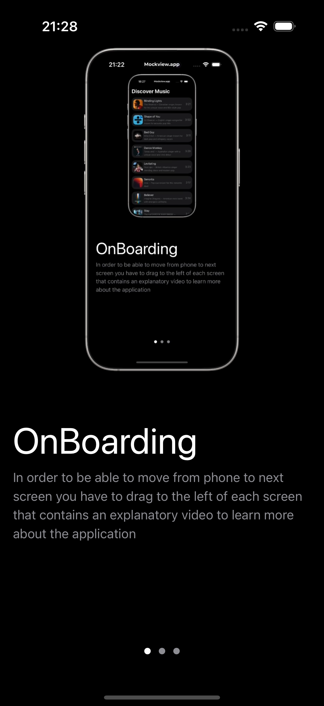
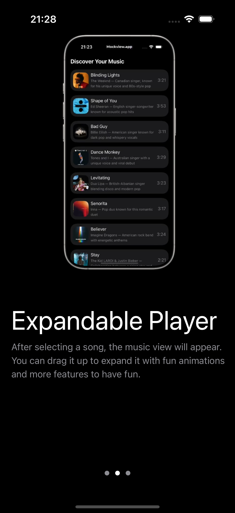
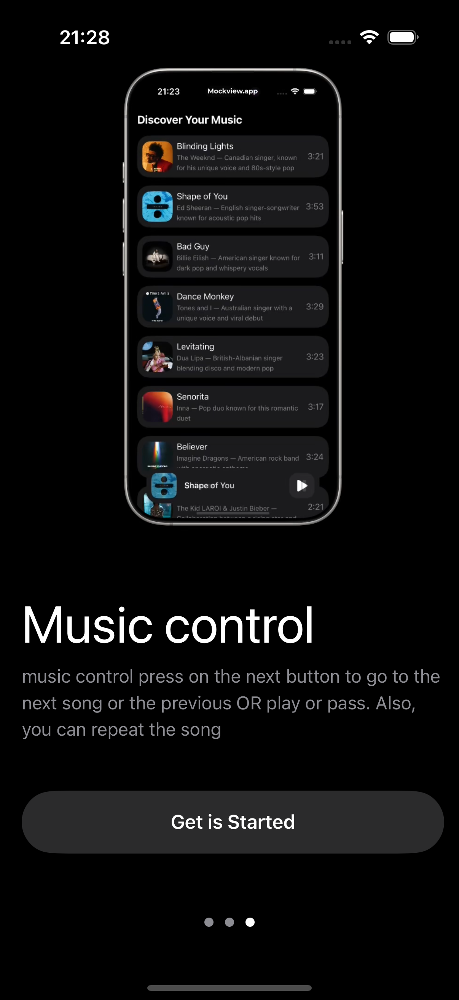
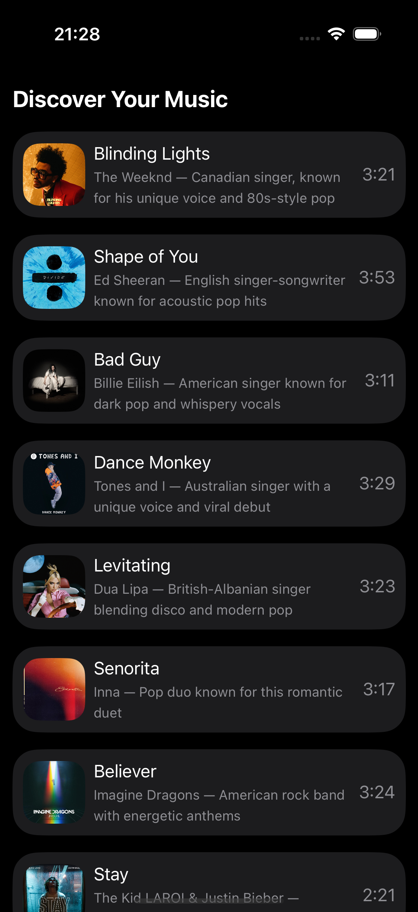
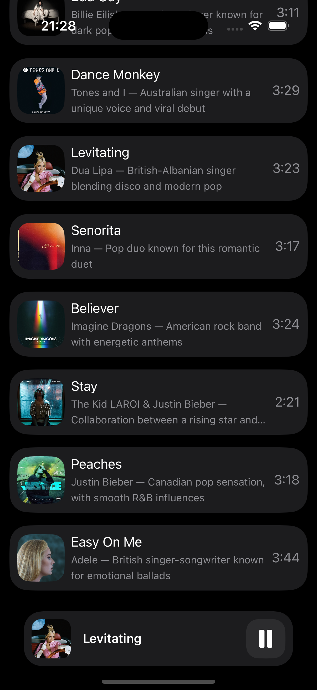
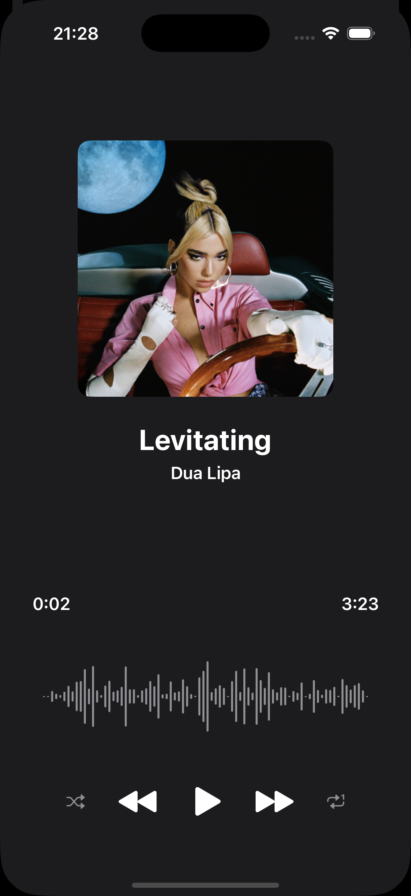
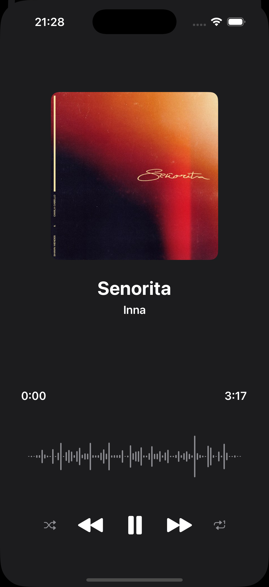
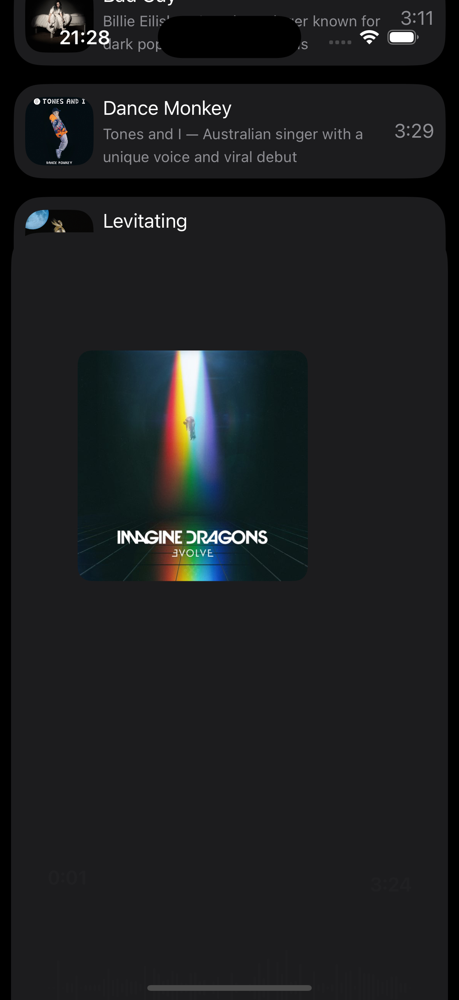

# 🎶 MusicAppCustomOnBoarding

**MusicAppCustomOnBoarding** — современное iOS-приложение для кастомного онбординга музыкального приложения.  
Используется кастомная анимация с плавными переходами между экранами при первом запуске или в обучающем режиме.

---

## 🔹 Скриншоты

<!-- Добавьте ваши скриншоты в папку screens и замените названия файлов ниже -->

  
  
  
  
  
  
  
  

<!-- Пр�� необходимости добавьте другие скриншоты -->

---

## 🔹 Возможности

- Многостраничный кастомный онбординг  
- Анимированные переходы между экранами  
- Классный дизайн и плавные свайпы  
- Поддержка темной/светлой темы  
- Привязка к вашему музыкальному приложению
- Пример интеграции с домашним экраном или авторизацией

---

## 🔹 Технологии

- Swift 5.9+  
- SwiftUI  
- UIKit (при необходимости)  
- Advanced Geometry (анимированные transitions)  
- Combine (реактивный подход к состоянию)  

---

## 🔹 Установка

1. Откройте проект в Xcode 15+  
2. Перейдите к папке с примером онбординга  
3. Запустите на симуляторе или устройстве для просмотра кастомной анимации  
4. Интегрируйте в свое музыкальное приложение, заменив изображения и тексты по необходимости

---

## 🔹 Использование

1. При первом запуске отображается последовательность онбординг-экранов  
2. Перелистывайте экраны с помощью свайпа  
3. После завершения онбординга приложение переходит к основному интерфейсу  
4. Тексты и картинки можно легко изменить под себя  
5. В коде есть комментарии для вашей кастомизации

---

## 🔹 Лицензия

MIT License © Hakob Ghlijyan
